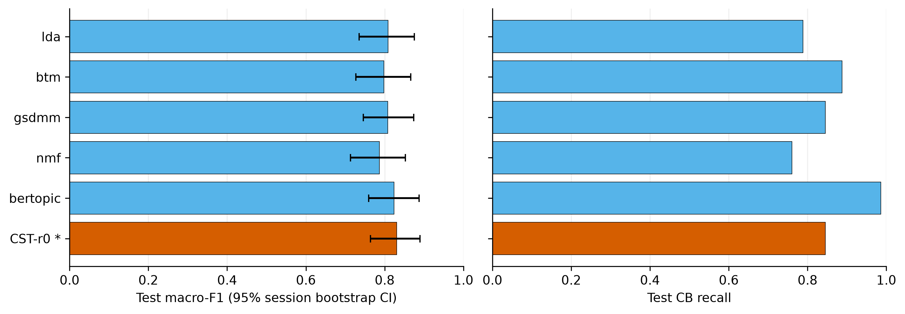
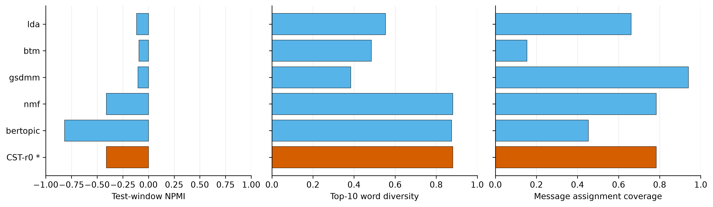
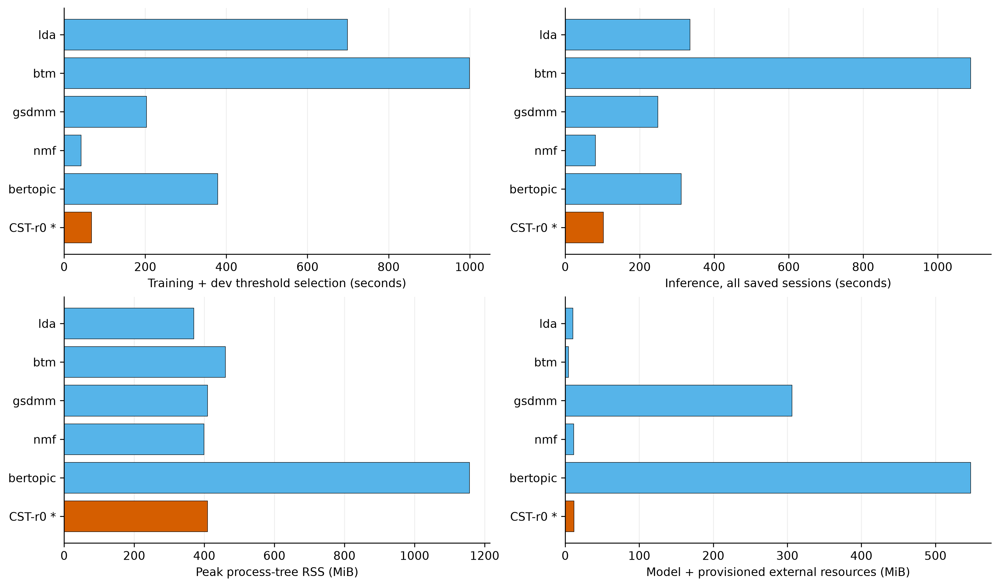

# full677：CST-MIL 与五个主题基线的固定会话比较

本报告回答：在同一 SCCD 会话划分上，经过验证集选择的 CST 是否在会话风险识别、主题输出和成本之间取得有用表现。主指标是测试 macro-F1，比较对象由验证集确定。

本轮冻结版本为 `cst_mil_r0`，验证集最强基线为 `nmf`。选定 CST 的测试 macro-F1 为 0.8304，高于该基线 0.0437；配对会话 bootstrap 的差值 95% 区间为 [-0.0159, 0.1027]。这描述一次固定拟合的结果，不是多随机种子的算法优越性结论。

## 数据与实验口径

完整会话数 677；清洗后评论数 38,872；训练/验证/测试为 406/135/136。随机种子只有 42，一个基线一次正式配置；CST 修订版不是独立重复实验。交叉拟合折数属于训练内部步骤。136 个测试会话中，60 个曾在旧版本中查看，76 个为新增测试会话；两部分分开报告。

全量 SCCD 可用规模为 677 个会话、38,872 条清洗后评论（原始 38,999 条）；3000 个完整会话不在现有数据中。所有数值性能仅在测试分区统计，训练会话的预测仅用于完整输出和断点验收。所有模型使用训练会话标签，评论标签只作测试证据评价。主题词表/模型只在训练分区拟合，阈值和版本选择只使用验证分区。

会话划分不等于用户隔离或所有重复文本隔离：Existing pilot has shared users/repeated comments; post separation is not a blanket no-leakage claim. CPU 线程上限 4；原生算法可能实际单线程。BERTopic 额外使用预训练多语句向量，CST 没有预训练模型。基线通过主题特征接共同风险头，CST 另有字符、回复和 MIL 通道，因此这不是纯主题算法的单变量消融。

## 风险识别比较

| 方法 | 选定 | 验证 macro-F1 | 测试 macro-F1 [95% CI] | CB Recall | CB Precision | AP | ROC-AUC |
| --- | --- | --- | --- | --- | --- | --- | --- |
| lda |  | 0.8148 | 0.8088 [0.7353, 0.8748] | 0.7887 | 0.8358 | 0.9174 | 0.9224 |
| btm |  | 0.8416 | 0.7983 [0.7268, 0.8658] | 0.8873 | 0.7683 | 0.9161 | 0.9077 |
| gsdmm |  | 0.7893 | 0.8078 [0.7455, 0.8739] | 0.8451 | 0.8000 | 0.8599 | 0.8789 |
| nmf |  | 0.8738 | 0.7868 [0.7128, 0.8527] | 0.7606 | 0.8182 | 0.9265 | 0.9183 |
| bertopic |  | 0.8344 | 0.8239 [0.7596, 0.8870] | 0.9859 | 0.7609 | 0.8530 | 0.8769 |
| cst_mil_r0 | 是 | 0.9256 | 0.8304 [0.7639, 0.8897] | 0.8451 | 0.8333 | 0.9465 | 0.9413 |
### 新增测试 fresh76：各方法风险指标

| 方法 | 会话数 | macro-F1 | CB Recall | CB Precision | AP | ROC-AUC |
| --- | --- | --- | --- | --- | --- | --- |
| lda | 76 | 0.7889 | 0.7805 | 0.8205 | 0.9230 | 0.9129 |
| btm | 76 | 0.7967 | 0.9024 | 0.7708 | 0.9135 | 0.9010 |
| gsdmm | 76 | 0.7617 | 0.7805 | 0.7805 | 0.8441 | 0.8418 |
| nmf | 76 | 0.7760 | 0.7561 | 0.8158 | 0.9355 | 0.9233 |
| bertopic | 76 | 0.8476 | 1.0000 | 0.7885 | 0.9058 | 0.8990 |
| cst_mil_r0 | 76 | 0.8137 | 0.8537 | 0.8140 | 0.9460 | 0.9345 |

选定 CST 相对本轮验证集最强基线的 macro-F1 差值为 0.0378，配对会话 bootstrap 95% 区间为 [-0.0277, 0.1051]。

新增测试子集：macro-F1 点值最高为 `bertopic`；AP 点值最高为 `cst_mil_r0`。排名只描述该固定测试子集，不使用测试指标重选版本；AP 衡量分数排序，macro-F1 还受已冻结阈值影响，二者不能互相替代。

### 已查看测试 seen60：各方法风险指标

| 方法 | 会话数 | macro-F1 | CB Recall | CB Precision | AP | ROC-AUC |
| --- | --- | --- | --- | --- | --- | --- |
| lda | 60 | 0.8331 | 0.8000 | 0.8571 | 0.9170 | 0.9344 |
| btm | 60 | 0.7991 | 0.8667 | 0.7647 | 0.9138 | 0.9089 |
| gsdmm | 60 | 0.8661 | 0.9333 | 0.8235 | 0.8751 | 0.9167 |
| nmf | 60 | 0.7998 | 0.7667 | 0.8214 | 0.9161 | 0.9133 |
| bertopic | 60 | 0.7943 | 0.9667 | 0.7250 | 0.8091 | 0.8511 |
| cst_mil_r0 | 60 | 0.8500 | 0.8333 | 0.8621 | 0.9489 | 0.9522 |

选定 CST 相对本轮验证集最强基线的 macro-F1 差值为 0.0502，配对会话 bootstrap 95% 区间为 [-0.0490, 0.1503]。

误差线是固定模型、按完整会话进行分层重采样得到的 95% 区间；不表示训练随机性。图中应同时观察宏平均表现和欺凌类召回，不能根据单个点值忽略漏检。星号表示验证集冻结的 CST 版本。

## 主题与证据

| 方法 | 全局主题数 | NPMI | 主题词多样性 | 覆盖率 | 退化主题比例 | 评论 AP | Top-3命中 | Top-3召回 |
| --- | --- | --- | --- | --- | --- | --- | --- | --- |
| lda | 32 | -0.1156 | 0.5531 | 0.6617 | 0.0000 | 0.3614 | 0.5050 | 0.0678 |
| btm | 32 | -0.0937 | 0.4844 | 0.1540 | 0.0000 | 0.3934 | 0.6436 | 0.0936 |
| gsdmm | 32 | -0.1026 | 0.3844 | 0.9398 | 0.0000 | 0.3617 | 0.6040 | 0.0903 |
| nmf | 32 | -0.4105 | 0.8812 | 0.7838 | 0.0000 | 0.4012 | 0.6337 | 0.0650 |
| bertopic | 167 | -0.8177 | 0.8753 | 0.4534 | 0.0180 | 0.3441 | 0.5842 | 0.0694 |
| cst_mil_r0 | 32 | -0.4105 | 0.8812 | 0.7838 | 0.0000 | 0.3701 | 0.6634 | 0.0844 |

证据评价分母按各方法实际记录保存于 CSV。选定 `cst_mil_r0` 的评论 AP 使用 8028 条有标签测试消息；Top-3 命中率与召回率仅在 101 个含正例评论的会话上宏平均。这个分母既不是全部测试会话数，也不是会话标签为 CB 的数量，Non-CB 会话也可能有正例评论。Top-3 召回率先用每会话检索到的正例数除以该会话全部正例评论数，再平均；长会话含较多正例时，该指标会受到固定只返回3条证据的限制。

NPMI、词语多样性和消息分配覆盖率分别描述共现、词表重复和分配行为；没有主题数量/边界人工真值。较高覆盖率可能包含错误分配，较高 NPMI 也不能证明主题属于风险。0/1/2/3 主题构造检查只验证接口与分段。系统输出的主题强度和消息风险分数不是已校准的类别置信度；本数据只监督 CB/Non-CB，不能据此声称已验证三个指定风险类别的多标签识别。

覆盖率按全部消息微平均（保留主题支持的消息数/全部消息数），不是先平均各会话比例。全局主题容量和单会话实际输出主题数不同。BERTopic 原生训练窗口离群比例为 0.3517；离群窗口没有被当成额外风险主题。

冻结 CST 在真实测试会话中的保留主题数量如下。分组依据是 SCCD 的会话 CB/Non-CB 标签，不是主题标签：

| 测试会话分组 | 会话数 | 0主题 | 1主题 | 2主题 | 3主题 | >3主题 | 最大值 | 平均值 |
| --- | --- | --- | --- | --- | --- | --- | --- | --- |
| all_test | 136 | 1 | 9 | 26 | 25 | 75 | 11 | 3.926 |
| non_cb_test | 65 | 1 | 7 | 20 | 9 | 28 | 7 | 3.154 |
| cb_test | 71 | 0 | 2 | 6 | 16 | 47 | 11 | 4.634 |

这些数字直接统计保存的 topics 数组，只能说明输出数量可变；没有人工主题数量真值，不能称为主题数量准确率。Non-CB 会话也可以包含多个正常讨论主题，因此“输出主题”不等于“检出风险”。超过3个主题可能来自真实多话题、同一话题被拆分或一般词语形成的因子，需要人工核对，不能单凭数量认定错误或正确。抽取式标题可能含“人”“没”等过于一般的词，标题可读性和过细分风险仍需验证；也不能将这些标题直接对应为网络欺凌、辱骂、言语暴力三个风险类别。该分布未用于更改冻结模型或重新选版。

案例采用预定规则：先列风险分数离 0.5 最远的一条误判（若存在），再列主题数量最多的测试会话。它们只帮助检查模型输出，不是随机样本或额外人工标注。

会话 `_GguDtSH7-7GlKBa`，数据集标签 `0`：选定 CST 风险分数 0.9881、预测 1；参照 nmf 风险分数 0.9619、预测 1。

cst_mil_r0 输出 6 个主题；展示至多前三个抽取式标题：没 / 自己 / 被; 中国 / 黑人; 垃圾。

原文证据 `MKeknPUSGivff-p4` / 匿名发言人 `J95UYizF1N49ccQF` / 风险分数 0.9770：

> 小垃圾

原文证据 `5hat1KHYx471Z-bM` / 匿名发言人 `3Y71X9DLpk4GXNSG` / 风险分数 0.9274：

> 再查一下加拿大队。他们也不是啥好东西。。也有磕药的历史。。严查。前三名应该都磕药了。。。

nmf 输出 6 个主题；展示至多前三个抽取式标题：没 / 自己 / 被; 中国 / 黑人; 垃圾。

原文证据 `zniw64OMblednn90` / 匿名发言人 `i29_Lbp0BWjyKkFe` / 风险分数 0.9600：

> 关键是什么时候的兴奋剂检查

原文证据 `MKeknPUSGivff-p4` / 匿名发言人 `J95UYizF1N49ccQF` / 风险分数 0.9555：

> 小垃圾

会话 `bN5QDbCMvgVYFrlH`，数据集标签 `1`：选定 CST 风险分数 0.9999、预测 1；参照 nmf 风险分数 0.9998、预测 1。

cst_mil_r0 输出 11 个主题；展示至多前三个抽取式标题：死; 没 / 自己 / 被; 垃圾。

原文证据 `v19FJzuzF3KpyrGB` / 匿名发言人 `2VON6UsCv4IhzUFO` / 风险分数 0.9506：

> 看在哪了，在上海大概率不是，警察特会调解

原文证据 `1zB8Yg-EZGlagOsH` / 匿名发言人 `Egn-X3j6RdtsXLDB` / 风险分数 0.9442：

> 报警

nmf 输出 11 个主题；展示至多前三个抽取式标题：死; 没 / 自己 / 被; 垃圾。

原文证据 `IfoEKFmDSGGBRBRq` / 匿名发言人 `PLOYHs82kWGaZZIB` / 风险分数 0.9792：

> 狗男女

原文证据 `96VZ1AEV8J19TLzD` / 匿名发言人 `fjalySDd9n3_BDVf` / 风险分数 0.9593：

> 国内这种垃圾真的不少

## 时间、内存与依赖成本

| 方法 | 训练含验证(s) | 全部推理(s) | 测试推理(s) | 峰值RSS(MiB) | 模型(MiB) | 外部编码器(MiB) | 外部运行时(MiB) |
| --- | --- | --- | --- | --- | --- | --- | --- |
| lda | 698.58 | 335.34 | 64.07 | 369.93 | 10.36 | 0.00 | 0.00 |
| btm | 999.83 | 1088.89 | 231.50 | 460.64 | 4.55 | 0.00 | 0.00 |
| gsdmm | 203.05 | 248.91 | 54.91 | 409.15 | 3.50 | 0.00 | 302.84 |
| nmf | 41.81 | 80.91 | 15.23 | 399.46 | 11.44 | 0.00 | 0.00 |
| bertopic | 378.58 | 311.18 | 222.56 | 1157.25 | 71.29 | 476.42 | 0.00 |
| cst_mil_r0 | 67.68 | 102.26 | 21.24 | 409.66 | 11.93 | 0.00 | 0.00 |

训练时间包含主题拟合、风险交叉拟合、最终重拟合、验证推理和阈值选择；具体阶段及实际风险分类器拟合次数见 CSV。推理耗时求和自逐会话检查点，包含该次真实编码/缓存行为，未用消息或窗口数冒充会话数。缓存会影响运行顺序和重启成本；已记录的逐会话冷编码/缓存计数器在统计附录单列，缺失计数器记 NA。

原生 LDA、BTM、GSDMM 的端到端时间包含子进程启动、模型文件读写和接口转换开销；这些数值描述本地适配流水线，不等于算法核心计算的复杂度比较。所有方法均按完整会话提交结果。

模型文件大小与外部资源分别列出。BERTopic 的编码器没有嵌入模型文件，运行仍需该编码器及 PyTorch 等依赖。Java 基线的运行时列统计本机预置完整 JDK 目录，包含编译器等开发文件，不代表仅推理所需的最小运行时。图中磁盘柱为模型加本机已计量的预置外部资源，不含共享 Python 环境、可重建嵌入缓存和训练日志，不能称为最小部署体积或完整安装体积。编码器逐文件按清单核对大小和 SHA-256；JDK 此处仅检查声明的 java 路径存在并汇总目录文件大小，未进行同等级的逐文件哈希验证。外部资源路径、模型指纹和共享缓存大小见 statistics.json。

## 修订、失败与允许的结论

历史 pilot300 资源政策排除记录：`benchmark/quarantine/pre_cpu_affinity_20260913/` 保留的是早期试验及烟雾运行，当时环境线程参数未能限制实际 CPU 使用；这些记录未用于 pilot300 选版或计时，当时没有解锁测试，也未执行 CST 修订。它们不是本轮 full677 的失败运行，更不是额外随机种子重复。本表来自当前 full677 完成的有效运行；当前运行的资源限制拒绝和中断另列如下，不与历史试验混合统计。

当前有效运行目录中保留的错误/中断记录如下；这些运行随后均已成功完成，不能将以下记录误称为算法最终失败。

| 方法 | 阶段 | 记录类型 | 最终状态 | 保留证据 |
| --- | --- | --- | --- | --- |
| btm | 训练 | CPU affinity 资源限制拒绝 | 成功完成 | `D:\github\intern\cst_mil\benchmark\runs\full677\btm\error_1789400245192974800.json` |
| btm | 推理 | CPU affinity 资源限制拒绝 | 成功完成 | `D:\github\intern\cst_mil\benchmark\runs\full677\btm\error_1789403337584154100.json` |
| bertopic | 见原始堆栈 | 用户中断（KeyboardInterrupt） | 成功完成 | `D:\github\intern\cst_mil\benchmark\runs\full677\bertopic\error_1789405284510416300.json` |

中断记录及原始堆栈仍保存在运行目录，statistics.json 同时汇总原记录；最终结果与这些尝试记录分开解释，不能由成功运行的阶段时间推算所有失败/中断尝试的总消耗。

下表 r0–r3 的修改、接受/拒绝和停止判据记录来自 pilot300 验证集选版，不是 full677 的再次迭代。本轮 full677 已重训的 CST 配置为 `cst_mil_r0`；冻结版本 `cst_mil_r0` 使用本轮 406 个训练会话重新拟合，在 135 个验证会话确定阈值。本轮没有根据测试结果重新选版；pilot300 的未改善修订及其结果仍保留在原目录。

| 修订 | 起点 | 更改 | 替换当前最佳 | 达到停止目标 |
| --- | --- | --- | --- | --- |
| r0 | 初始 | r0 完整改造 | True | False |
| r1 | r0 | word_features | False | False |
| r2 | r0 | risk_weighted_topics | False | False |
| r3 | r0 | multiscale | False | False |

pilot300 冻结选版时的 `stop_target_met=False`：若为 False，表示当时迭代预算内未达到全部质量门槛；这不是 full677 上重新检验停止目标的结论。当前全量结果只评价已冻结版本，不能把试验阶段的停止状态当成本轮成功或失败判定。

没有额外的未完成 CST 运行目录。

允许的结论：`cst_mil_r0` 在本次固定会话测试中取得表内风险指标，并能生成数量可变的主题及原文证据。依据为已校验的逐会话预测、metrics.json 和冻结版本记录。

禁止扩大的结论：尚不能声称普遍优于全部方法、跨种子稳定领先、真实多风险标签识别已达标、主题通道带来因果收益、风险分数已校准或长对话语义理解已经充分验证。仍需独立用户/事件划分、多随机种子、风险主题及边界标注和适当消融。

下一步：补充多随机种子实验、人工主题及边界标注，并分析冻结阈值的影响与漏检案例；不依据本轮测试结果回调现有模型。

## 可复核文件

- [逐项数值 CSV](comparisons.csv)、[统计细节](stats-appendix.md)、[图目录](figure-catalog.md)、[机器可读统计](statistics.json)。
- 原运行目录：`D:\github\intern\cst_mil\benchmark\runs\full677`；每个运行保存模型、源码/依赖绑定、训练摘要、逐会话原子结果。
- 冻结选择：`D:\github\intern\cst_mil\benchmark\selection.json`；数据指纹：`8d378a0b7c1dc9485baf462dab393105b1992610e5c3d4bf173c0645730d35e0`。

本报告由 results-analysis 的证据与不确定性规则生成；没有进行 Obsidian 写回。
