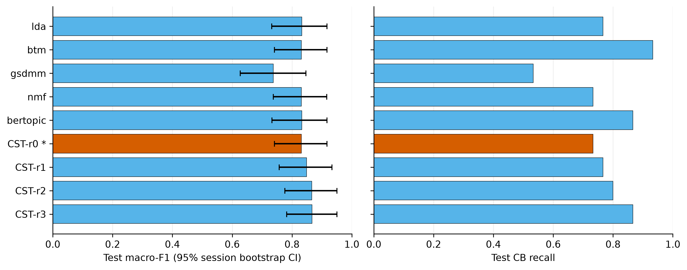
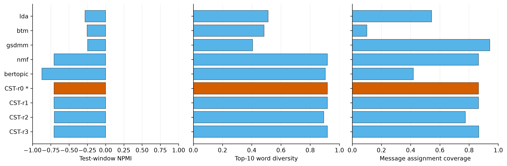
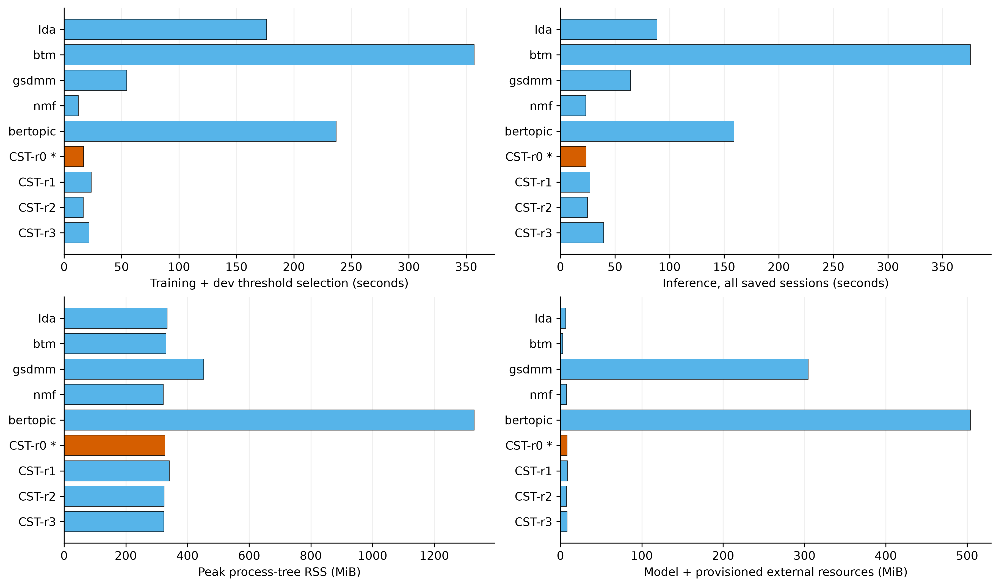

# pilot300：CST-MIL 与五个主题基线的固定会话比较

本报告回答：在同一 SCCD 会话划分上，经过验证集选择的 CST 是否在会话风险识别、主题输出和成本之间取得有用表现。主指标是测试 macro-F1，比较对象由验证集确定。

本轮冻结版本为 `cst_mil_r0`，验证集最强基线为 `bertopic`。选定 CST 的测试 macro-F1 为 0.8316，低于该基线 0.0015；配对会话 bootstrap 的差值 95% 区间为 [-0.1065, 0.1004]。这描述一次固定拟合的结果，不是多随机种子的算法优越性结论。

## 数据与实验口径

完整会话数 300；清洗后评论数 17,312；训练/验证/测试为 180/60/60。随机种子只有 42，一个基线一次正式配置；CST 修订版不是独立重复实验。交叉拟合折数属于训练内部步骤。这 60 个测试会话在旧版本分析中已经被查看，不能称为完全未接触的新测试集。

全量 SCCD 可用规模为 677 个会话、38,872 条清洗后评论（原始 38,999 条）；3000 个完整会话不在现有数据中。所有数值性能仅在测试分区统计，训练会话的预测仅用于完整输出和断点验收。所有模型使用训练会话标签，评论标签只作测试证据评价。主题词表/模型只在训练分区拟合，阈值和版本选择只使用验证分区。

会话划分不等于用户隔离或所有重复文本隔离：Existing pilot has shared users/repeated comments; post separation is not a blanket no-leakage claim. CPU 线程上限 4；原生算法可能实际单线程。BERTopic 额外使用预训练多语句向量，CST 没有预训练模型。基线通过主题特征接共同风险头，CST 另有字符、回复和 MIL 通道，因此这不是纯主题算法的单变量消融。

## 风险识别比较

| 方法 | 选定 | 验证 macro-F1 | 测试 macro-F1 [95% CI] | CB Recall | CB Precision | AP | ROC-AUC |
| --- | --- | --- | --- | --- | --- | --- | --- |
| lda |  | 0.7147 | 0.8326 [0.7321, 0.9165] | 0.7667 | 0.8846 | 0.8987 | 0.9000 |
| btm |  | 0.8500 | 0.8316 [0.7413, 0.9166] | 0.9333 | 0.7778 | 0.9171 | 0.9189 |
| gsdmm |  | 0.8141 | 0.7377 [0.6267, 0.8465] | 0.5333 | 0.9412 | 0.8878 | 0.8944 |
| nmf |  | 0.8333 | 0.8316 [0.7377, 0.9161] | 0.7333 | 0.9167 | 0.9186 | 0.9300 |
| bertopic |  | 0.8833 | 0.8331 [0.7330, 0.9166] | 0.8667 | 0.8125 | 0.8794 | 0.8922 |
| cst_mil_r0 | 是 | 0.8667 | 0.8316 [0.7412, 0.9165] | 0.7333 | 0.9167 | 0.9058 | 0.9178 |
| cst_mil_r1 |  | 0.8667 | 0.8490 [0.7569, 0.9333] | 0.7667 | 0.9200 | 0.9052 | 0.9222 |
| cst_mil_r2 |  | 0.8667 | 0.8661 [0.7758, 0.9499] | 0.8000 | 0.9231 | 0.9364 | 0.9511 |
| cst_mil_r3 |  | 0.8653 | 0.8667 [0.7818, 0.9500] | 0.8667 | 0.8667 | 0.9122 | 0.9256 |

误差线是固定模型、按完整会话进行分层重采样得到的 95% 区间；不表示训练随机性。图中应同时观察宏平均表现和欺凌类召回，不能根据单个点值忽略漏检。星号表示验证集冻结的 CST 版本。

## 主题与证据

| 方法 | 全局主题数 | NPMI | 主题词多样性 | 覆盖率 | 退化主题比例 | 评论 AP | Top-3命中 | Top-3召回 |
| --- | --- | --- | --- | --- | --- | --- | --- | --- |
| lda | 32 | -0.2817 | 0.5125 | 0.5438 | 0.0000 | 0.3204 | 0.5682 | 0.0697 |
| btm | 32 | -0.2539 | 0.4844 | 0.1007 | 0.0000 | 0.3643 | 0.5227 | 0.0512 |
| gsdmm | 32 | -0.2464 | 0.4062 | 0.9425 | 0.0000 | 0.3095 | 0.5227 | 0.0681 |
| nmf | 32 | -0.7065 | 0.9187 | 0.8645 | 0.0000 | 0.4041 | 0.6364 | 0.0586 |
| bertopic | 95 | -0.8725 | 0.9038 | 0.4192 | 0.0105 | 0.3408 | 0.6364 | 0.0892 |
| cst_mil_r0 | 32 | -0.7065 | 0.9187 | 0.8645 | 0.0000 | 0.3040 | 0.5000 | 0.0710 |
| cst_mil_r1 | 32 | -0.7065 | 0.9187 | 0.8645 | 0.0000 | 0.3429 | 0.5909 | 0.0965 |
| cst_mil_r2 | 32 | -0.7020 | 0.8938 | 0.7750 | 0.0000 | 0.3040 | 0.5000 | 0.0710 |
| cst_mil_r3 | 32 | -0.7065 | 0.9187 | 0.8664 | 0.0000 | 0.3040 | 0.5000 | 0.0710 |

证据评价分母按各方法实际记录保存于 CSV。选定 `cst_mil_r0` 的评论 AP 使用 3564 条有标签测试消息；Top-3 命中率与召回率仅在 44 个含正例评论的会话上宏平均。这个分母既不是全部测试会话数，也不是会话标签为 CB 的数量，Non-CB 会话也可能有正例评论。Top-3 召回率先用每会话检索到的正例数除以该会话全部正例评论数，再平均；长会话含较多正例时，该指标会受到固定只返回3条证据的限制。

NPMI、词语多样性和消息分配覆盖率分别描述共现、词表重复和分配行为；没有主题数量/边界人工真值。较高覆盖率可能包含错误分配，较高 NPMI 也不能证明主题属于风险。0/1/2/3 主题构造检查只验证接口与分段。系统输出的主题强度和消息风险分数不是已校准的类别置信度；本数据只监督 CB/Non-CB，不能据此声称已验证三个指定风险类别的多标签识别。

覆盖率按全部消息微平均（保留主题支持的消息数/全部消息数），不是先平均各会话比例。全局主题容量和单会话实际输出主题数不同。BERTopic 原生训练窗口离群比例为 0.3200；离群窗口没有被当成额外风险主题。

冻结 CST 在真实测试会话中的保留主题数量如下。分组依据是 SCCD 的会话 CB/Non-CB 标签，不是主题标签：

| 测试会话分组 | 会话数 | 0主题 | 1主题 | 2主题 | 3主题 | >3主题 | 最大值 | 平均值 |
| --- | --- | --- | --- | --- | --- | --- | --- | --- |
| all_test | 60 | 0 | 11 | 16 | 12 | 21 | 7 | 3.033 |
| non_cb_test | 30 | 0 | 9 | 9 | 6 | 6 | 6 | 2.533 |
| cb_test | 30 | 0 | 2 | 7 | 6 | 15 | 7 | 3.533 |

这些数字直接统计保存的 topics 数组，只能说明输出数量可变；没有人工主题数量真值，不能称为主题数量准确率。Non-CB 会话也可以包含多个正常讨论主题，因此“输出主题”不等于“检出风险”。超过3个主题可能来自真实多话题、同一话题被拆分或一般词语形成的因子，需要人工核对，不能单凭数量认定错误或正确。抽取式标题可能含“人”“没”等过于一般的词，标题可读性和过细分风险仍需验证；也不能将这些标题直接对应为网络欺凌、辱骂、言语暴力三个风险类别。该分布未用于更改冻结模型或重新选版。

案例采用预定规则：先列风险分数离 0.5 最远的一条误判（若存在），再列主题数量最多的测试会话。它们只帮助检查模型输出，不是随机样本或额外人工标注。

会话 `_GguDtSH7-7GlKBa`，数据集标签 `0`：选定 CST 风险分数 0.9990、预测 1；参照 bertopic 风险分数 0.9682、预测 1。

cst_mil_r0 输出 5 个主题；展示至多前三个抽取式标题：人 / 自己 / 看; 中国 / 垃圾 / 黑人; 笑。

原文证据 `5hat1KHYx471Z-bM` / 匿名发言人 `3Y71X9DLpk4GXNSG` / 风险分数 0.9592：

> 再查一下加拿大队。他们也不是啥好东西。。也有磕药的历史。。严查。前三名应该都磕药了。。。

原文证据 `WNOrrTUeMmN691hr` / 匿名发言人 `3Y71X9DLpk4GXNSG` / 风险分数 0.9308：

> 再查一下美国4*100的选手。。估计也是磕药了。。只不过当天药性没有起效而已。所以才被淘汰的。。他们的4*400男女都该是磕药的。。。

bertopic 输出 2 个主题；展示至多前三个抽取式标题：磕药 / 新冠 / 疫苗; 中国。

原文证据 `X8QQWQZOgF4vwZBI` / 匿名发言人 `GrTdpVbaLcn1emb1` / 风险分数 0.7342：

> 老美是觉得自己用药都没跑过 所以质疑了

原文证据 `JC6o0gWnNJ0_yGa9` / 匿名发言人 `4VO65NTImCaoJvza` / 风险分数 0.7342：

> 好像哪个选手还可以申请一轮检测 ，如果还是阳性才取消 现在还不确定

会话 `-8P4bITJBrV9gVYh`，数据集标签 `1`：选定 CST 风险分数 0.9995、预测 1；参照 bertopic 风险分数 1.0000、预测 1。

cst_mil_r0 输出 7 个主题；展示至多前三个抽取式标题：彩虹 / 美国 / 抓; 人 / 自己 / 对; 歧视 / 大肆宣扬 / chinese。

原文证据 `Hi3cMzJpkbRoJEUf` / 匿名发言人 `PM2p70ljC_uIS-j3` / 风险分数 0.8996：

> 这个意思是lgbt群体都是？

原文证据 `P-GirNavlLNTUP9G` / 匿名发言人 `QkGw74lQTcgWmPBc` / 风险分数 0.8903：

> 你的理解只代表你个人……

bertopic 输出 3 个主题；展示至多前三个抽取式标题：敢 / 中国 / 搞; 男人; 上海 / 人。

原文证据 `X0f37NL3ICgZlI-F` / 匿名发言人 `rm72xZui0ICBf64p` / 风险分数 0.8572：

> 打中国旗号好宣传，说不定还有钱赚 国外的也没得办法，国内现在也很多lgbt,上海不就有一个外国人创办的组织么，上海傲娇周，真tm无语这些人

原文证据 `Rr78_Kaj0UoIhHzj` / 匿名发言人 `yxECWRbRPUZJLqzY` / 风险分数 0.8076：

> 我们身边的彩虹不会打着彩虹的旗号

## 时间、内存与依赖成本

| 方法 | 训练含验证(s) | 全部推理(s) | 测试推理(s) | 峰值RSS(MiB) | 模型(MiB) | 外部编码器(MiB) | 外部运行时(MiB) |
| --- | --- | --- | --- | --- | --- | --- | --- |
| lda | 176.28 | 88.52 | 17.51 | 334.20 | 6.53 | 0.00 | 0.00 |
| btm | 356.97 | 375.74 | 75.68 | 330.78 | 2.72 | 0.00 | 0.00 |
| gsdmm | 54.61 | 64.19 | 12.56 | 452.42 | 1.79 | 0.00 | 302.84 |
| nmf | 12.50 | 23.15 | 4.46 | 321.55 | 7.71 | 0.00 | 0.00 |
| bertopic | 236.84 | 158.94 | 121.69 | 1329.59 | 27.73 | 476.42 | 0.00 |
| cst_mil_r0 | 16.87 | 23.50 | 4.52 | 326.84 | 8.19 | 0.00 | 0.00 |
| cst_mil_r1 | 23.60 | 26.96 | 5.52 | 340.85 | 8.64 | 0.00 | 0.00 |
| cst_mil_r2 | 16.67 | 24.76 | 4.93 | 324.02 | 7.64 | 0.00 | 0.00 |
| cst_mil_r3 | 21.64 | 39.64 | 8.39 | 323.66 | 8.19 | 0.00 | 0.00 |

训练时间包含主题拟合、风险交叉拟合、最终重拟合、验证推理和阈值选择；具体阶段及实际风险分类器拟合次数见 CSV。推理耗时求和自逐会话检查点，包含该次真实编码/缓存行为，未用消息或窗口数冒充会话数。缓存会影响运行顺序和重启成本；已记录的逐会话冷编码/缓存计数器在统计附录单列，缺失计数器记 NA。

原生 LDA、BTM、GSDMM 的端到端时间包含子进程启动、模型文件读写和接口转换开销；这些数值描述本地适配流水线，不等于算法核心计算的复杂度比较。所有方法均按完整会话提交结果。

模型文件大小与外部资源分别列出。BERTopic 的编码器没有嵌入模型文件，运行仍需该编码器及 PyTorch 等依赖。Java 基线的运行时列统计本机预置完整 JDK 目录，包含编译器等开发文件，不代表仅推理所需的最小运行时。图中磁盘柱为模型加本机已计量的预置外部资源，不含共享 Python 环境、可重建嵌入缓存和训练日志，不能称为最小部署体积或完整安装体积。编码器逐文件按清单核对大小和 SHA-256；JDK 此处仅检查声明的 java 路径存在并汇总目录文件大小，未进行同等级的逐文件哈希验证。外部资源路径、模型指纹和共享缓存大小见 statistics.json。

## 修订、失败与允许的结论

资源政策排除记录：`benchmark/quarantine/pre_cpu_affinity_20260913/` 保留了初轮 LDA/BTM/GSDMM/NMF 训练与验证、被中断的 BERTopic，以及当时的烟雾记录。初轮发现环境线程参数未能限制实际 CPU 使用，因此不用于本表计时或选版；没有解锁测试，也未执行 CST 修订。当前表格来自修复后统一 CPU 亲和性限制的替代运行。这不是额外随机种子重复，不能把两轮合成均值或标准差。

所有完整 CST 修订均列入表格；选定标记来自冻结的 selection.json，不能用测试排名反向更换版本。未改善版本仍然保留。

| 修订 | 起点 | 更改 | 替换当前最佳 | 达到停止目标 |
| --- | --- | --- | --- | --- |
| r0 | 初始 | r0 完整改造 | True | False |
| r1 | r0 | word_features | False | False |
| r2 | r0 | risk_weighted_topics | False | False |
| r3 | r0 | multiscale | False | False |

冻结时是否达到预定停止目标：`False`。若为 False，表示迭代预算内仍未达到全部质量门槛，不能解释为全面超过基线。

没有额外的未完成 CST 运行目录。

允许的结论：`cst_mil_r0` 在本次固定会话测试中取得表内风险指标，并能生成数量可变的主题及原文证据。依据为已校验的逐会话预测、metrics.json 和冻结版本记录。

禁止扩大的结论：尚不能声称普遍优于全部方法、跨种子稳定领先、真实多风险标签识别已达标、主题通道带来因果收益、风险分数已校准或长对话语义理解已经充分验证。仍需独立用户/事件划分、多随机种子、风险主题及边界标注和适当消融。

下一步：保留当前冻结版本，并使用准备好的逐方法全量命令扩大到 677 个会话；全量阶段重新在 406 个训练会话拟合，不能直接把本轮模型当成全量训练结果。新的 76 个测试会话应独立报告。若本报告已经是 full677，则下一步是补充独立标注与跨划分验证。

## 可复核文件

- [逐项数值 CSV](comparisons.csv)、[统计细节](stats-appendix.md)、[图目录](figure-catalog.md)、[机器可读统计](statistics.json)。
- 原运行目录：`D:\github\intern\cst_mil\benchmark\runs\pilot300`；每个运行保存模型、源码/依赖绑定、训练摘要、逐会话原子结果。
- 冻结选择：`D:\github\intern\cst_mil\benchmark\selection.json`；数据指纹：`b5336b29ac9bfdd5dddbe41305f5ce28d175fa52becf3e82cbaa054e00e14696`。

本报告由 results-analysis 的证据与不确定性规则生成；没有进行 Obsidian 写回。
